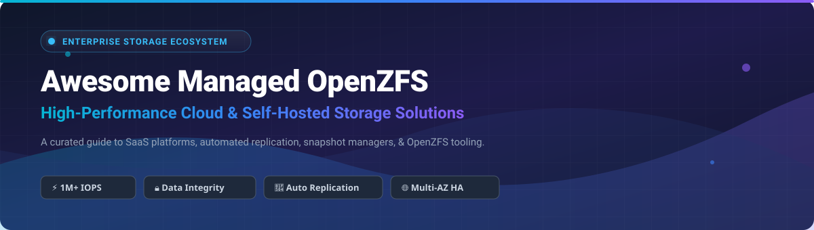

# Awesome Managed OpenZFS File Storage 💾 ⚡

  

  
  
  
  
  
  

## 📌 Top Managed OpenZFS File Storage & Open-Source Storage Ecosystem 🚀

**A Curated List of Enterprise SaaS Products, Managed OpenZFS Platforms, and Open-Source Storage Tools** 🛠️

*Focused on Cloud Managed OpenZFS, High-Performance File Systems, Self-Hosted ZFS Automation & Snapshots*

**Last updated: October 2026** 📅

---

### 🔍 Overview & Industry Architecture

This repository tracks notable **commercial managed OpenZFS platforms** and **open-source GitHub projects** that provision, manage, scale, and automate ZFS-based file storage — from enterprise cloud offerings with sub-millisecond latencies to self-hosted GUIs, snapshot routines, and backup replication engines.

---

## 📊 Market Overview & SaaS Platforms 🌐

> [!NOTE]
> **Market Size & Structure**: The global cloud file storage and high-performance managed NAS market is estimated at **$7.8 Billion (2026)** with a projected CAGR of 18.2%. The market is **moderately fragmented**, led by public hyper-scalers (AWS, Google Cloud) alongside specialized high-performance storage vendors (Pure Storage, NetApp, Qumulo) and dedicated open-source storage appliances (TrueNAS, Open-E).

### 🏢 SaaS & Cloud Managed Storage Comparison

The table below lists leading commercial managed OpenZFS file storage offerings and enterprise file platforms, ordered by company size (valuation / revenue, descending):

| Platform / Vendor | Enterprise Size (Valuation / Revenue) 📈 | Specific Starting Pricing 💲 | Free Tier / Trial Limit 🎁 | Description & Core Strengths ℹ️ |
| :--- | :--- | :--- | :--- | :--- |
| **[Google Cloud Filestore](https://cloud.google.com/filestore)** ☁️ | **~$2.0 Trillion** *(Alphabet Market Cap)* | **$0.16 / GB / month** (Basic HDD tier) | **$300 free credits** for 90 days across GCP services | Google's fully managed NFS file storage for compute instances & GKE. *(NFS alternative)* |
| **[Amazon FSx for OpenZFS](https://aws.amazon.com/fsx/openzfs/)** 🚀 | **~$1.9 Trillion** *(Amazon Market Cap)* | **$0.09 / GB / month** (Single-AZ SSD storage) | **AWS Free Tier**: 750 hrs/month free trial credit for select FSx tiers | Fully managed OpenZFS on AWS delivering 1M+ IOPS, sub-ms latencies, ZSTD compression & instant cloning. |
| **[Pure Storage FlashBlade](https://www.purestorage.com/)** ⚡ | **~$16 Billion** *(Market Cap)* | **~$0.15 / GB / month** equivalent via Evergreen//One | **30-day risk-free enterprise trial** / test-drive demo sandbox | Unified all-flash file & object storage platform optimized for AI, HPC, and rapid restore workloads. |
| **[NetApp Cloud Volumes ONTAP](https://www.netapp.com/)** 💾 | **~$22 Billion** *(Market Cap)* | **$0.10 / GB / month** (PAYGO capacity badge) | **30-day free trial** (up to 500 GB storage allocation) | Enterprise-grade cloud file management with multi-cloud NFS/SMB/iSCSI support. *(Non-ZFS baseline)* |
| **[OVHcloud HA-NAS](https://www.ovhcloud.com/)** 🇪🇺 | **~$1.8 Billion** *(Market Cap)* | **$0.06 / GB / month** (€0.055/GB, starting 3 TB pool) | **14-day money-back guarantee** on initial cloud NAS pool provision | Fully managed high-availability shared file storage powered by OpenZFS in European data centers. |
| **[Qumulo Cloud Q](https://qumulo.com/)** 📊 | **~$1.2 Billion** *(Valuation)* | **$0.12 / GB / month** (Azure/AWS Marketplace baseline) | **14-day cloud trial sandbox** with 5 TB test data allocation | Scale-out enterprise file storage with real-time analytics for media, life sciences, and unstructured data. |
| **[Zadara Storage Cloud](https://www.zadara.com/)** 📦 | **~$350 Million** *(Valuation)* | **$0.08 / GB / month** (zStorage virtual array pricing) | **7-day free trial** with $500 usage credit | Storage-as-a-Service (STaaS) platform offering fully isolated zPools with NFS, SMB, and iSCSI access. |
| **[Nextcloud Hub Enterprise](https://nextcloud.com/)** 🤝 | **~$100 Million** *(Private / Est. Value)* | **$38.50 / user / year** (~$3.20/user/mo, Basic 100 users) | **60-day free enterprise trial** (or 100% free self-hosted Community edition) | Sovereign collaboration suite optimized for deployment on top of ZFS-backed high-integrity arrays. |
| **[TrueNAS Cloud / iXsystems](https://www.truenas.com/)** 🐬 | **~$80 Million** *(Private / Est. Value)* | **$0.015 / GB / month** (TrueNAS Cloud storage sync target) | **1 kmode / 10 GB free forever** cloud backup target allocation | Cloud management & cloud sync integration for TrueNAS SCALE with S3 & rclone encryption. |
| **[Open-E JovianDSS Cloud](https://www.open-e.com/)** 🛡️ | **~$40 Million** *(Private / Est. Value)* | **$450 / license unit** (one-time base node entry tier) | **60-day fully functional trial software key** | ZFS-based software-defined storage software engineered for high-availability enterprise SAN/NAS clusters. |

---

## 🛠️ Open-Source GitHub Projects 🔓

> Open-source software powers the core of modern file storage. Below are top-tier open-source GitHub projects for ZFS pool management, snapshot automation, cluster replication, and backup integration — **sorted by GitHub Star count (descending)**.

| Project Name | Stars ⭐ | Primary Purpose / Highlights 💡 | License 📜 |
| :--- | :--- | :--- | :--- |
| **[rclone/rclone](https://github.com/rclone/rclone/stargazers)** ☁️ |  | Universal cloud storage sync CLI supporting 70+ providers & rclone crypt encryption for ZFS backups. | MIT |
| **[restic/restic](https://github.com/restic/restic/stargazers)** 🔒 |  | Fast, secure, deduplicated backup engine with native S3, Azure, and SFTP backends. | BSD-2-Clause |
| **[borgbackup/borg](https://github.com/borgbackup/borg/stargazers)** 📦 |  | Space-efficient deduplicating archiver with authenticated encryption and compression. | BSD-3-Clause |
| **[openzfs/zfs](https://github.com/openzfs/zfs/stargazers)** 🧠 |  | The official OpenZFS file system & volume manager codebase for Linux and FreeBSD. | CDDL-1.0 |
| **[jimsalterjrs/sanoid](https://github.com/jimsalterjrs/sanoid/stargazers)** 🔄 |  | Policy-driven ZFS snapshot management (`sanoid`) and high-speed replication engine (`syncoid`). | GPL-3.0 |
| **[truenas/middleware](https://github.com/truenas/middleware/stargazers)** 🐬 |  | Core backend middleware powering TrueNAS SCALE and CORE ZFS storage systems. | BSD-3-Clause |
| **[kimono-koans/httm](https://github.com/kimono-koans/httm/stargazers)** ⏱️ |  | Interactive, file-level Time Machine-like CLI tool for browsing ZFS snapshots instant restores. | MPL-2.0 |
| **[democratic-csi/democratic-csi](https://github.com/democratic-csi/democratic-csi/stargazers)** ☸️ |  | Kubernetes CSI driver providing dynamic ZFS volume provisioning (zfs-local, TrueNAS, FreeNAS, OpenE). | MIT |
| **[zrepl/zrepl](https://github.com/zrepl/zrepl/stargazers)** 🔁 |  | One-stop ZFS backup & structured replication daemon with TLS authentication & pruning policies. | MIT |
| **[zbm-dev/zfsbootmenu](https://github.com/zbm-dev/zfsbootmenu/stargazers)** 🥾 |  | Bootloader for root-on-ZFS systems with snapshot booting & native dataset encryption support. | MIT |
| **[AlchemillaHQ/Sylve](https://github.com/AlchemillaHQ/Sylve/stargazers)** 🌿 |  | Lightweight FreeBSD infrastructure management GUI for Bhyve VMs, FreeBSD Jails, and ZFS pools. | BSD-2-Clause |
| **[zfsonlinux/zfs-auto-snapshot](https://github.com/zfsonlinux/zfs-auto-snapshot/stargazers)** 📸 |  | Classic, lightweight cron-driven automatic snapshot service for ZFS pools on Linux. | BSD-2-Clause |
| **[psy0rz/zfs_autobackup](https://github.com/psy0rz/zfs_autobackup/stargazers)** 🤖 |  | Automated periodic ZFS filesystem backup engine with incremental send/receive support. | GPL-3.0 |
| **[oetiker/znapzend](https://github.com/oetiker/znapzend/stargazers)** ⏳ |  | Open-source ZFS snapshot worker and destination replication daemon with customizable schedules. | GPL-3.0 |
| **[zfsnap/zfsnap](https://github.com/zfsnap/zfsnap/stargazers)** ✂️ |  | Portable sh script for automated ZFS snapshot generation & expiring old snapshots. | BSD-2-Clause |
| **[pdf/zfs_exporter](https://github.com/pdf/zfs_exporter/stargazers)** 📈 |  | Prometheus exporter for detailed ZFS pool health, ARC stats, capacity, and IOPS metrics. | MIT |
| **[optimans/cockpit-zfs-manager](https://github.com/optimans/cockpit-zfs-manager/stargazers)** 🖥️ |  | Cockpit web console module for interactive pool creation, dataset management, and snapshotting. | MIT |
| **[webzfs/webzfs](https://github.com/webzfs/webzfs/stargazers)** 🌐 |  | Modern web-based GUI for ZFS built with Python FastAPI, HTMX, and Tailwind CSS. | AGPL-3.0 |

---

## 🎯 Architecture Guidelines & Best Practices 📋

When designing self-hosted or hybrid cloud ZFS architectures:

1. **Direct Disk Access (HBA Mode)** 🔌: ZFS requires raw, direct disk access for error correction and checksum verification. Avoid hardware RAID controllers unless configured in IT/HBA mode.
2. **Memory Allocation (ARC Cache)** 🧠: Allocate ~1 GB of RAM per 1 TB of storage as a baseline for optimal Adaptive Replacement Cache performance.
3. **Capacity Limits** ⚠️: Maintain pool capacity below 80% to ensure peak write performance and prevent fragmentation degradation.
4. **Compression Standards** 🗜️: Enable `zstd` (Zstandard) or `lz4` compression on datasets for high throughput with negligible CPU overhead.

---

## 💖 Support & Buy Me a Coffee

If you find this repository helpful, please consider showing your support:
- 🌟 **Star this repository** on GitHub
- 🍴 **Fork & Share** it with storage engineers, sysadmins, and cloud architects
- ☕ **Sponsor / Buy a coffee**: If you'd like to support ongoing maintenance and research, consider sponsoring via the [GitHub Sponsor Dashboard](https://github.com/sponsors/ishandutta2007).

Thank you for being part of the open-source storage community! 🙌

---

## 🤝 How to Contribute

Contributions are welcome! To add or update a platform:
1. Fork this repository 🍴
2. Add your entry following the structure in `README.md` 📝
3. Ensure pricing, license, and repo details are verified 🔍
4. Submit a Pull Request 🚀

---

## ⚠️ Disclaimer

- This curated list is maintained for educational and architectural reference purposes.
- Product pricing and tier details reflect market data as of **October 2026** and may vary by cloud region.

---

## 📊 Star History

---

  <b>Made with ❤️ for storage engineers, sysadmins, and cloud architects.</b>

